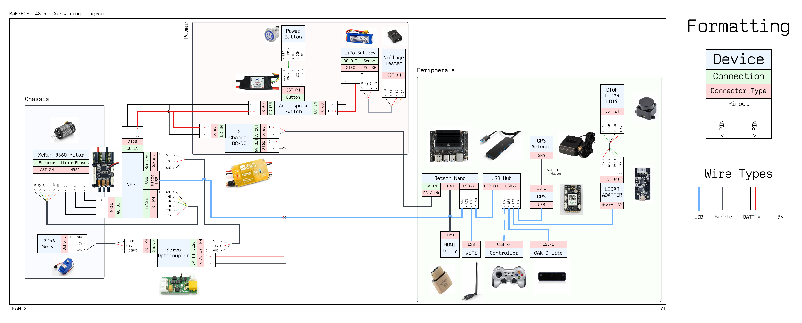
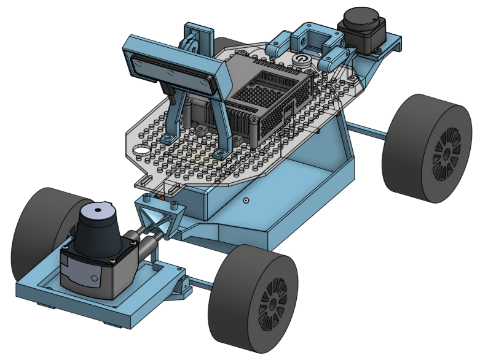
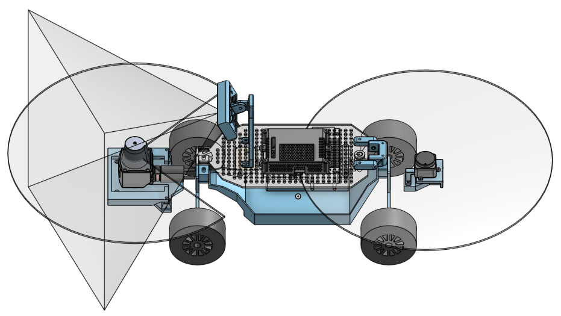
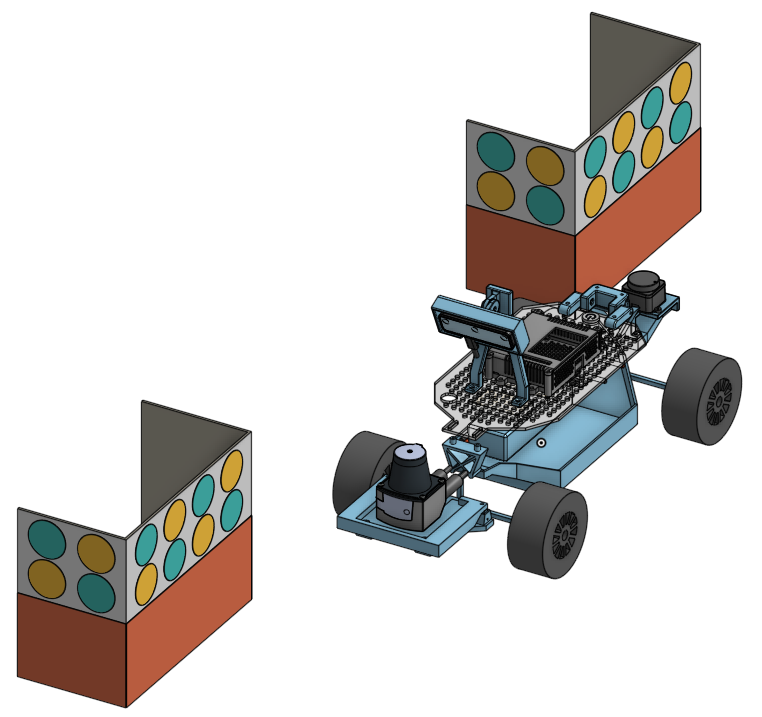
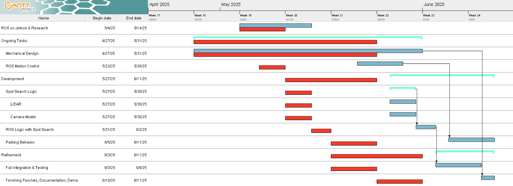

# ECE MAE 148 - Team 2

# Spring 2025 Final Project - Self Parking
[Final Presentation](https://docs.google.com/presentation/d/1LYtDfWw0KNp87Ibz-X-V0k7ANJAOO4ydioHknXktUfY/edit?slide=id.p#slide=id.p)
### Team Members
 - Giovanni Bernal Ramirez - MAE
 - Manasvi Boppudi - ECE
 - Yingxuan Ouyang - ECE
 - Kevin Nguyen - MAE

### Table of Contents
- [Overview](#Overview)
- [Key Features](#Key-Features)
- [How to Run](#How-to-Run)
- [Hardware](#Hardware)
- [Challenges](#Challenges)
- [Areas of Improvement](#Areas-of-Improvement)
- [Acknowledgements](#Acknowledgements)
- [Course Resources](#Course-Resources)
- [Other Course Deliverables](#Other-Course-Deliverables)
## Overview
This project was to develop a self-parallel-parking robot utilizing only a single camera and 2 2-D LiDARs. It will autonomously navigate until it detects other vehicles and starts to detect and evaluate potential parking spots.
### Main Objectives
- Object collision avoidance
- Park into parallel spaces
### Nice to Haves
- Ability to park into much tighter spaces by doing multi-point turns
- Reverse parking into perpendicular spots
## Key Features
- **Computer Vision**: Finds other cars to recognize where parking spaces are available. Helps guides the LiDARs and with vehicle guidance
- **Collision Avoidance**: LiDARs prevent the vehicle from hitting an obstacle
## How to Run
### Requirements

## Hardware
### General RC Car Wiring Diagram

### Components (May not be in Wiring Diagram)
- **Traxxas 1/10 Ford Fiesta Chassis**
- **Jetson Nano** - Main processing unit
- **FLIPSKY 75100 Pro V2.0 VESC** - Motor and steering controller
- **OAK-D Lite Camera** - Computer vision
- **DTOF LiDAR LD19** - Rear LiDAR sensor
- **SICK TiM571-2050101** - Front LiDAR sensor
### CAD
---
Our project relied heavily on CAD for cable management, sensor mounting & integration, and course planning. Onshape was used.

**CAD files can be found in the `cad` folder**
#### Car CAD

#### Car CAD w/ FOV Overlays

#### Course CAD (Car with Obstacles)

## Challenges
Like most projects, this project required a mix of both technical and project managing knowledge.

### Technical
---
- Multitude of technical issues that required significant time to debug
	- **Wi-Fi** connectivity was spotty, interrupting SSH sessions that threw away work
	- **Compatibility issues** with certain versions of Python not working with OpenCV while certain versions of OpenCV did not worth with the Jetson requiring rebuilding and specific prerequisite versions.
	- **Hardware** provided had limited documentation, significantly slowing down diagnosing of faulty components. Servos, motors, VESCs, and Wi-Fi adapters had to be replaced.
- Documentation
	- Specific hardware documentation was lacking in specifications or troubleshooting requiring guess-work or timely analysis of PCBs.
	- Lack of internal team documentation from past-bugs or day-to-day changes caused many small delays where team members would have to ask others for specific settings/commands
### Project Management
---
- Underestimated time for debug and testing
- Underutilization of human resources
	- **Software & Hardware** projects were often dependent on each other. Looking back, delaying one side to advance the other could be a worthwhile investment. Especially since Hardware is dependent on hours of certain facilities whereas software can be developed almost anywhere.

#### Project Gantt Chart

The Gantt chart shows the actual project timeline (dark cyan) to the initial baseline (red). The area between the baseline and actual was due to a multitude of technical issues when doing the OpenCV lane following.

## Areas of Improvement
- **Better Spot Evaluation Logic**: Shape fitting algorithms & deeper sensor fusion to measure parking spaces more accurately
- **Automatic Dataset Collection**: Improving the computer vision model to a point where it can help with annotating images
- **Dynamic Parking Spot Detection**: Differentiates between parallel, perpendicular, and drive-in spaces
- **Improved Motion Controls & Path Planning**: Better initial position & multi-point turning to get into very narrow spaces
## Acknowledgements
Thank you to the dedicated staff that made this course possible and helping us throughout the quarter
- **Professor - Jack Silberman**
- **TA - Alexander**
- **TA - Winston**
- **TA - Jingli**
## Course Resources
[Course Website](https://ucsd-ecemae-148.github.io/)
- Contains primary documentation and past ECE MAE 148 final projects
## Other Course Deliverables
- [Donkey Car Autonomous Laps](https://youtube.com/shorts/SDO8L6csyMs)
- [Donkey Car GPS Laps](https://www.youtube.com/shorts/bQW3wik1WEM?si=BMjtb4AWy1tpJWZM)
- [OpenCV Lane Following](https://www.youtube.com/shorts/oZnYPm4y-rA?feature=share)

